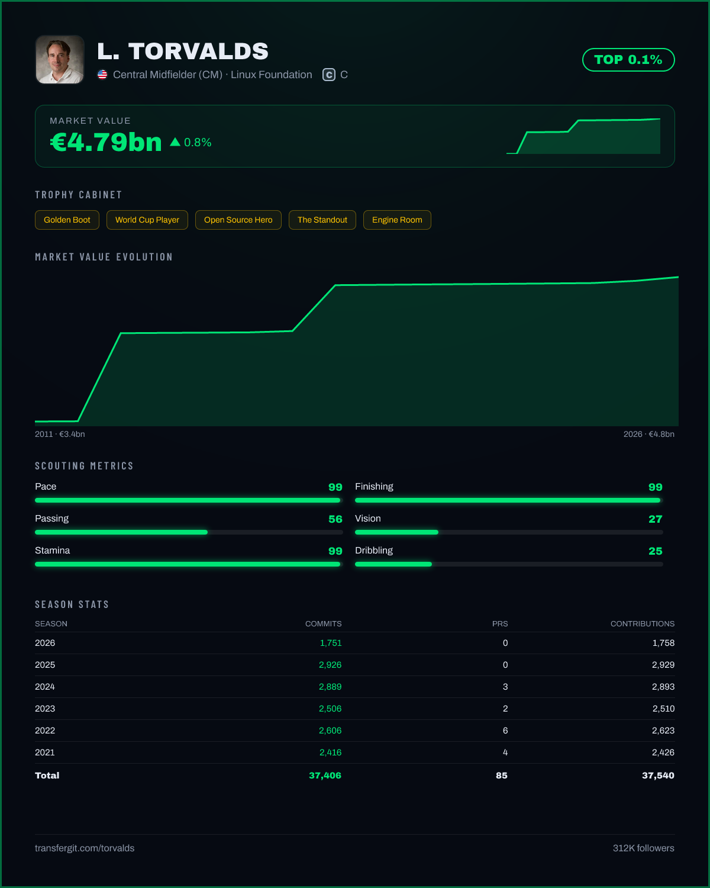

<div align="center">


<h1 align="center">transfergit</h1>

**Your GitHub, valued like a football player.**

[](https://github.com/tobiager/transfergit/stargazers)
[](LICENSE)
[](https://transfergit.com)
[](#contributing)

### **[⚽ Get your card →](https://transfergit.com)**

<a href="https://transfergit.com/torvalds"></a>

</div>

---

**Next.js 15 · TypeScript · Tailwind v4 · GSAP + Lenis · @vercel/og · GitHub GraphQL API**

## Get your card

1. Go to **[transfergit.com](https://transfergit.com)** and type your username.
2. Hit **Copy Markdown** and paste it into your GitHub profile README.

```md
[](https://transfergit.com/YOUR_USERNAME)
```

That's it — the card is a live SVG, so it updates and animates on its own, no re-commit needed.

## Player

Every profile includes:

-  **Market value in euros** — real formula, deliberately absurd inputs
-  **Transfer history** — pulled from the orgs you've actually joined
-  **Injury history** — burnout streaks detected from your commit calendar
-  **Trophy cabinet** — 14 achievements across squad / international / Ballon d'Or tiers
-  **Scouting metrics** — commits, stars, PRs, reviews, streaks, normalized 0-99
-  **Season-by-season stats** — one row per year you've shown up
-  **Rank vs. legends** — percentile tier from PROSPECT to TOP 0.1%
-  **Hall of Fame** — see where you land next to torvalds, gaearon, and co.
-  **5 export formats** — README · Full (4:5), Player card (1:1), Portrait (3:4), Story (9:16), Banner (16:9)

<details>
  <summary><b>⚽ View TransferGit profile and market statistics (Click to expand)</b></summary>
  <br>
  <p align="center">
    <a href="https://transfergit.com/torvalds"></a>
  </p>
</details>

### How the market value works

```
value = 50,000
      + commits        × €800
      + stars          × €4,000
      + followers      × €6,000
      + pull requests  × €2,500
      + repos >10★     × €25,000

× form multiplier   (up to +50%, based on last 12 months' commits)
× age multiplier    (0.8× under 2 years, 1.1× over 6 — young prospect vs. veteran)
```

| ⚽ Football | 🐙 GitHub |
|---|---|
| Goals | Commits |
| Assists | Pull requests |
| Yellow cards | Issues opened |
| Caps / appearances | Repos with traction |
| Transfer fee | Market value |
| Injury | 14+ day commit-free streak |
| Preferred foot | Typed language (right) vs. dynamic (left) |
| Position | Dominant language category |

Is it scientific? No. Is your value higher than Messi's? Probably. ⚽

## Squad

Paste any `owner/repo` and TransferGit fields a starting XI from its contributors — ranked and valued the same
way a player card is, then slotted onto the pitch by commit rank.

- **Formations** — 4-3-3 by default, with 4-4-2 / 3-5-2 / 4-2-3-1 and a drag-and-drop custom layout
- **Captain** — the repo's top contributor by commits
- **Bench** — reserves beyond the starting XI
- **Squad value** — the summed market value of every player on the pitch

Try it: **`transfergit.com/squad/<owner>/<repo>`** — for example [`transfergit.com/squad/facebook/react`](https://transfergit.com/squad/facebook/react).

<p align="center">
  <a href="https://transfergit.com/squad/facebook/react">
    
  </a>
</p>

Embed a squad in a README the same way as a player card:

```md
[](https://transfergit.com/squad/OWNER/REPO)
```

## Contributing

Contributor guidelines live in [`CONTRIBUTING.md`](CONTRIBUTING.md). Deep-dive docs live in [`/docs`](docs/):
[architecture](docs/architecture.md), [Repo Squad pipeline](docs/squad.md), [market value formula](docs/market-value.md),
[exports](docs/exports.md), [caching & rate limits](docs/caching-and-rate-limits.md), and [formations](docs/formations.md).

The roadmap lives in the repo's [issues](https://github.com/tobiager/transfergit/issues) — check issues labeled
**[`good first issue`](https://github.com/tobiager/transfergit/issues?q=is%3Aissue+is%3Aopen+label%3A%22good+first+issue%22)**
for a place to start.

---

<div align="center">

Built by [@tobiager](https://github.com/tobiager) in Argentina 🇦🇷 during the 2026 World Cup

*Transfergit is a parody project, not affiliated with or endorsed by Transfermarkt GmbH & Co. KG. All GitHub data is public; nothing is stored beyond a cached snapshot. No sign-up, no tracking.*

</div>
